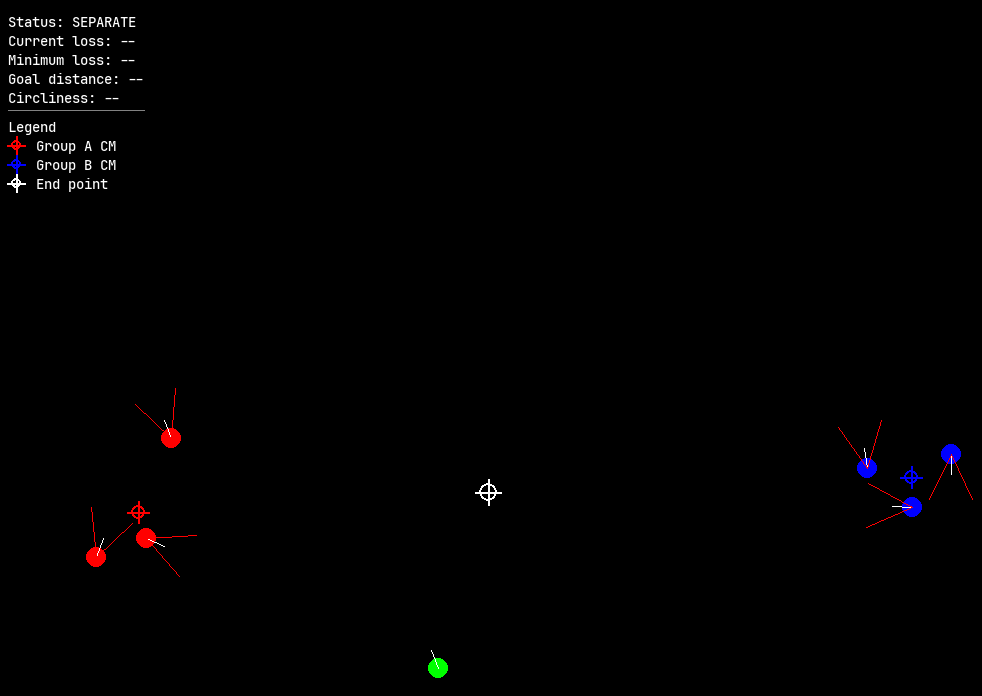

# leader-assisted-swarm

This repository contains a simulation with two initially separated milling swarms and one human-controlled leader.

The agents follow the same binary sensing rule:

- If another agent is detected, perform action `a`.
- If nothing is detected, perform action `b`.

The leader is controlled manually and is treated like any other detectable agent.

The objective is to use the leader to:

1. Bring the two milling groups together.
2. Move the combined milling group toward the end point.
3. Escape from the combined group without breaking the milling structure.

## Questions

**Question 1:** Does the same approach still work when each group contains more than three agents (`n > 3`)?

**Question 2:** After the two milling groups merge, can the leader escape from the combined milling structure?

## Simulation



## Display

The simulation shows:

- A red center marker for Group A
- A blue center marker for Group B
- One yellow center marker after the groups merge
- A white marker for the final end point
- Whether the groups are separate or merged
- The current loss
- The minimum loss reached during the run
- The distance from the combined group center to the end point
- The circliness score

Before the two groups merge, the simulation shows two separate center markers.

After the groups merge, the two markers are replaced by one combined center marker.

The loss is calculated only after the two groups merge.

## Loss Function

Suppose the merged swarm contains $N$ milling agents. The position of agent $i$ is:

```math
\mathbf{p}_i =
\begin{bmatrix}
x_i \\
y_i
\end{bmatrix}
```

The center of the merged swarm is:

```math
\mathbf{c}
=
\frac{1}{N}
\sum_{i=1}^{N}
\mathbf{p}_i
=
\begin{bmatrix}
c_x \\
c_y
\end{bmatrix}
```

Therefore:

```math
c_x = \frac{1}{N}\sum_{i=1}^{N}x_i,
\qquad
c_y = \frac{1}{N}\sum_{i=1}^{N}y_i
```

Let the end point be:

```math
\mathbf{g} =
\begin{bmatrix}
x_g \\
y_g
\end{bmatrix}
```

The distance between the center of the merged swarm and the end point is:

```math
d_{\mathrm{goal}}
=
\left\|\mathbf{c}-\mathbf{g}\right\|_2
=
\sqrt{(c_x-x_g)^2+(c_y-y_g)^2}
```

For each agent, define its distance from the swarm center as:

```math
r_i
=
\left\|\mathbf{p}_i-\mathbf{c}\right\|_2
=
\sqrt{(x_i-c_x)^2+(y_i-c_y)^2}
```

The smallest and largest distances from the swarm center are:

```math
r_{\min}=\min_i r_i,
\qquad
r_{\max}=\max_i r_i
```

The shape error is:

```math
\phi
=
1-\frac{r_{\min}^2}{r_{\max}^2}
```

Let $\theta_i$ be the heading of agent $i$. The direction from the swarm center to agent $i$ is:

```math
\beta_i
=
\operatorname{atan2}(y_i-c_y,\ x_i-c_x)
```

The motion error is:

```math
\tau
=
\frac{1}{N}
\sum_{i=1}^{N}
\left|
\cos(\theta_i-\beta_i)
\right|
```

The circliness score is:

```math
C
=
1-\max(\phi,\tau)
```

The loss is:

```math
J
=
d_{\mathrm{goal}}+(1-C)
```

Expanding both $d_{\mathrm{goal}}$ and $C$, the complete loss is:

```math
J
=
\sqrt{(c_x-x_g)^2+(c_y-y_g)^2}
+
\max\left(
1-\frac{r_{\min}^2}{r_{\max}^2},
\frac{1}{N}
\sum_{i=1}^{N}
\left|
\cos(\theta_i-\beta_i)
\right|
\right)
```

The leader is not included in the loss calculation. Only the milling agents are used.

A lower loss is better. The best possible loss is `0`, which means:

- The center of the merged swarm is at the end point.
- The agents are equally spaced from the swarm center.
- The agents move tangentially around the swarm center.

The loss is calculated only after the two groups merge. The simulation displays both the current loss and the minimum loss reached during the run.

## Quickstart

```bash
git clone https://github.com/shan002/leader-assisted-swarm
cd leader-assisted-swarm

uv venv
source .venv/bin/activate

uv pip install -r requirements.txt
python run_simulation.py
```

Depending on your operating system and shell, use the appropriate environment activation command:

| Shell | OS | Activation command |
|---|---|---|
| CMD.exe | Windows | `.\.venv\Scripts\activate` |
| PowerShell | Windows | `.\.venv\Scripts\activate.ps1` |
| NuShell | Windows | `overlay use .\.venv\Scripts\activate.nu` |
| bash/zsh | Linux/macOS | `source .venv/bin/activate` |
| Fish | Linux/macOS | `source .venv/bin/activate.fish` |
| NuShell | Linux/macOS | `overlay use .venv/bin/activate.nu` |

## Controls

The leader can be controlled using the arrow keys:

- Up arrow: move forward
- Down arrow: move backward
- Left arrow: turn left
- Right arrow: turn right

Click inside the simulation window if the arrow keys do not respond.